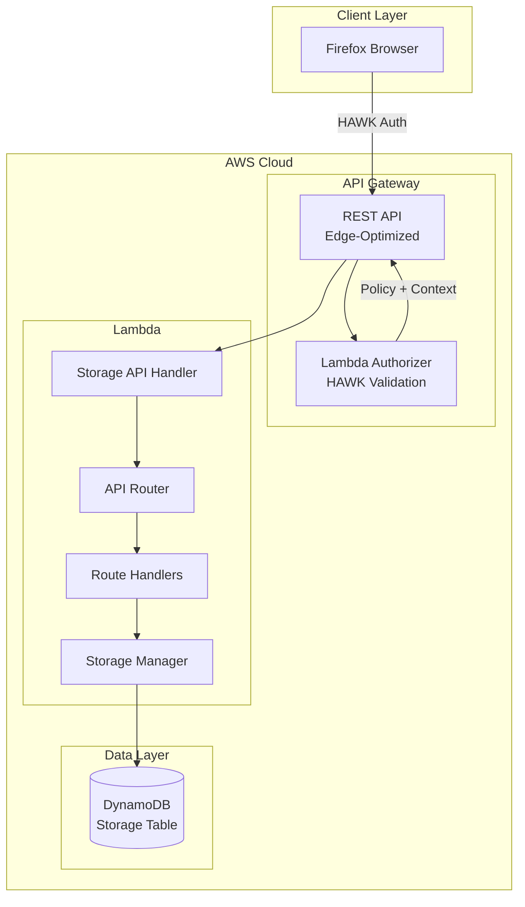

# Design Document: Firefox Sync Storage Server

## Overview

This document describes the technical design for implementing a Firefox Sync Storage Server as a serverless AWS Lambda function. The Storage Server provides a REST API for storing and retrieving user sync data (bookmarks, tabs, history, passwords, forms) organized as Basic Storage Objects (BSOs) within named collections, following the Mozilla Firefox Sync Storage API 1.5 specification.

The implementation leverages the existing project architecture with AWS Lambda (Python 3.14), API Gateway, and DynamoDB, using the established patterns for routing, dependency injection, and exception handling.

## Architecture



### Request Flow

1. Firefox client sends HAWK-authenticated request to API Gateway
2. API Gateway invokes Lambda Authorizer with HAWK credentials
3. Lambda Authorizer validates HAWK signature, extracts user ID, and returns IAM policy
4. API Gateway caches authorization result and invokes Storage API handler with user context
5. Lambda handler delegates to ApiRouter which routes to appropriate Route handler
6. Route handler uses StorageManager for DynamoDB operations (scoped to authenticated user)
7. Response includes appropriate headers (X-Last-Modified, X-Weave-Timestamp)

### Key Design Decisions

1. **Single-Table Design**: All BSOs and collection metadata stored in one DynamoDB table using composite keys (PK/SK pattern)
2. **Serverless Architecture**: Lambda + API Gateway for automatic scaling and pay-per-use
3. **Route Pattern**: Each endpoint is a separate route class for maintainability and testability
4. **Dependency Injection**: ServiceProvider pattern for lazy initialization and easy testing
5. **Lambda Authorizer for HAWK**: Separates authentication/authorization from business logic, enables caching, and provides consistent security enforcement

## Components and Interfaces

### Route Handlers

Each route follows the `BaseRoute` pattern with `bind()` and `handle()` methods:

| Route | Path | Method | Description |
|-------|------|--------|-------------|
| `ReadBSORoute` | `/storage/{collection}/{id}` | GET | Get single BSO |
| `UpdateBSORoute` | `/storage/{collection}/{id}` | PUT | Create/update BSO |
| `DeleteBSORoute` | `/storage/{collection}/{id}` | DELETE | Delete single BSO |
| `ReadCollectionRoute` | `/storage/{collection}` | GET | List BSOs with filtering |
| `CreateCollectionRoute` | `/storage/{collection}` | POST | Batch create/update BSOs |
| `DeleteCollectionRoute` | `/storage/{collection}` | DELETE | Delete BSOs or collection |
| `ReadCollectionsInfoRoute` | `/info/collections` | GET | Collection timestamps |
| `ReadCollectionCountsRoute` | `/info/collection_counts` | GET | BSO counts per collection |
| `ReadCollectionUsageRoute` | `/info/collection_usage` | GET | Storage usage per collection |
| `ReadQuotaInfoRoute` | `/info/quota` | GET | User quota information |
| `ReadConfigurationRoute` | `/info/configuration` | GET | Server limits |
| `DeleteAllStorageRoute` | `/storage` | DELETE | Delete all user data |
| `DeleteAllRootRoute` | `/` | DELETE | Delete all user data (alias) |

### Lambda Authorizer

| Component | Trigger | Description |
|-----------|---------|-------------|
| `HawkAuthorizer` | API Gateway REQUEST authorizer | Validates HAWK credentials, returns IAM policy + user context |

### HawkAuthorizer (HAWK Authentication)

The Lambda Authorizer handles HAWK authentication and authorization, running before the main Storage API handler.

```python
class HawkAuthorizer:
    def authorize(self, event: dict) -> AuthPolicy:
        """
        Validates HAWK credentials and returns IAM policy.
        
        Args:
            event: API Gateway authorizer event containing:
                - authorizationToken: HAWK Authorization header
                - methodArn: Resource ARN being accessed
                - requestContext: Request metadata
        
        Returns:
            AuthPolicy with:
                - principalId: User ID extracted from HAWK credentials
                - policyDocument: IAM policy (Allow/Deny)
                - context: Additional context (user_id, hawk_id) passed to handler
        
        Raises:
            Returns Deny policy for:
                - Missing or malformed HAWK header
                - Invalid HAWK signature
                - Expired HAWK credentials
                - Unknown HAWK key ID
        """
```

**Authorizer Response Format:**

```python
@dataclass
class AuthPolicy:
    principal_id: str           # User ID from HAWK credentials
    policy_document: dict       # IAM policy document
    context: dict               # Passed to Lambda handler via requestContext
```

**Context passed to handler:**

```json
{
  "user_id": "abc123",
  "hawk_id": "hawk-key-id",
  "authenticated_at": 1702345678.12
}
```

**Design Rationale:**
- Separates authentication from business logic for cleaner code
- Enables API Gateway caching of authorization results (configurable TTL)
- Provides consistent 401 responses before handler invocation
- User context is securely passed via API Gateway, not client-controlled

### StorageManager Interface

```python
class StorageManager:
    def get_storage_object(collection_name: str, object_id: str) -> BasicStorageObject
    def update_storage_object(collection_name: str, object_id: str, **kwargs) -> BasicStorageObject
    def delete_storage_object(collection_name: str, object_id: str) -> float
    def get_collection(collection_name: str) -> CollectionData
    def get_collection_objects(collection_name: str, **filters) -> Dict
    def create_or_update_collection(collection_name: str, objects: List[BasicStorageObject]) -> Tuple[CollectionData, BatchResult]
    def update_collection(collection_name: str, objects: List[BasicStorageObject], if_unmodified_since: Optional[float]) -> Tuple[CollectionData, BatchResult]
    def delete_collection(collection_name: str) -> float
    def delete_collection_objects(collection_name: str, ids: List[str]) -> float
    def delete_all_storage() -> float
    def list_collections() -> List[CollectionData]
    def get_collection_counts() -> Dict[str, int]
    def get_collection_usage() -> Dict[str, float]
    def get_quota() -> Tuple[float, Optional[float]]  # (usage_kb, quota_kb or None)
```

**Design Rationale for StorageManager:**
- `delete_collection_objects()` supports selective deletion with `ids` parameter (Requirement 4.1)
- `delete_all_storage()` supports complete user data deletion (Requirement 4.6, 4.7)
- `get_collection_counts()` and `get_collection_usage()` provide efficient metadata queries without loading all BSOs (Requirements 7.2, 7.3)
- `get_quota()` returns user's current usage and quota limit (Requirement 7.4)

### Exception Hierarchy

```
SyncStorageException (base)
├── ValidationException (400)
├── AuthenticationException (401)
├── CollectionNotFoundException (404)
├── StorageObjectNotFoundException (404)
├── MethodNotAllowedException (405)
├── ConflictException (409)
├── PreconditionFailedException (412)
├── RequestTooLargeException (413)
├── UnsupportedMediaTypeException (415)
├── QuotaExceededException (400, code 14)
└── ServerLimitExceededException (400, code 17)
```

### Mozilla Response Codes

The server uses Mozilla's numeric response codes in error responses:

| Code | Description | HTTP Status |
|------|-------------|-------------|
| 6 | JSON parse failure | 400 |
| 8 | Invalid BSO | 400 |
| 13 | Invalid collection name | 400 |
| 14 | Storage quota exceeded | 400 |
| 16 | Incompatible client | 400 |
| 17 | Server limit exceeded | 400 |

## Data Models

### BasicStorageObject

```python
@dataclass
class BasicStorageObject:
    id: str                    # Unique ID within collection (max 64 chars, printable ASCII)
    payload: str               # JSON-encoded data (encrypted by client)
    modified: float            # Seconds since epoch, 2 decimal precision
    sortindex: Optional[int]   # Sort order (max 9 digits)
    ttl: Optional[int]         # Time-to-live in seconds (WRITE-ONLY, not returned in responses)
```

**Note:** Per the Mozilla spec, TTL is a write-only field. It is accepted on PUT/POST but never returned in GET responses.

### CollectionData

```python
@dataclass
class CollectionData:
    name: str                  # Collection name (max 32 chars, urlsafe-base64 + period)
    modified: float            # Last modification timestamp
    count: int                 # Number of BSOs
    usage: int                 # Storage usage in bytes
```

**Collection Name Validation:**
- Maximum 32 characters
- Allowed characters: alphanumeric (a-z, A-Z, 0-9), underscore, hyphen, period
- This is the urlsafe-base64 alphabet plus period

### BatchResult

```python
@dataclass
class BatchResult:
    success: List[str]         # IDs of successfully processed BSOs
    failed: Dict[str, str]     # ID -> error message (string, not array per Mozilla spec)
    modified: float            # Operation timestamp
```

### DynamoDB Schema

Single-table design with composite primary key:

| Attribute | Type | Description |
|-----------|------|-------------|
| PK | String | Partition key: `USER#{user_id}#COLLECTION#{collection_name}` |
| SK | String | Sort key: `METADATA` or `OBJECT#{object_id}` |
| id | String | BSO ID (for objects) |
| name | String | Collection name (for metadata) |
| payload | String | BSO payload |
| modified | Number | Modification timestamp |
| sortindex | Number | Sort index (optional) |
| ttl | Number | TTL in seconds (optional, stored but not returned) |
| expiry | Number | DynamoDB TTL attribute (epoch seconds for auto-deletion) |
| count | Number | BSO count (for metadata) |
| usage | Number | Storage usage (for metadata) |

### Server Configuration Limits

```python
MAX_REQUEST_BYTES = 2 * 1024 * 1024      # 2 MB
MAX_POST_RECORDS = 100                    # BSOs per batch
MAX_POST_BYTES = 2 * 1024 * 1024         # 2 MB total payload
MAX_RECORD_PAYLOAD_BYTES = 256 * 1024    # 256 KB per BSO
MAX_TOTAL_RECORDS = None                  # Unlimited (for batched uploads)
MAX_TOTAL_BYTES = None                    # Unlimited (quota-based)
MAX_IDS_PER_REQUEST = 100                 # Max IDs in ids= parameter
```

## Correctness Properties

*A property is a characteristic or behavior that should hold true across all valid executions of a system-essentially, a formal statement about what the system should do. Properties serve as the bridge between human-readable specifications and machine-verifiable correctness guarantees.*

Based on the prework analysis, the following correctness properties have been identified. Redundant properties have been consolidated where one property implies another or where properties can be combined.

### Property 1: BSO Round-Trip Consistency

*For any* valid BSO with id, payload, and sortindex, storing it via PUT and then retrieving it via GET SHALL return an equivalent BSO with matching id, payload, sortindex, and modified fields (TTL is not returned).

**Validates: Requirements 1.1, 1.2**

### Property 2: BSO Deletion Removes Object

*For any* existing BSO in a collection, after a DELETE request, a subsequent GET request for that BSO SHALL return a 404 status code.

**Validates: Requirements 1.5, 1.6**

### Property 3: X-Last-Modified Header Consistency

*For any* BSO retrieval operation, the `X-Last-Modified` header value SHALL equal the BSO's `modified` field value.

**Validates: Requirements 1.7, 5.4, 5.5**

### Property 4: Collection Listing Completeness

*For any* collection containing BSOs, a GET request to `/storage/{collection}` SHALL return all BSO IDs in the collection, and with `full=true` SHALL return complete BSO objects (without TTL field).

**Validates: Requirements 2.1, 2.3**

### Property 5: Empty Collection Returns Empty List

*For any* non-existent or empty collection, a GET request to `/storage/{collection}` SHALL return an empty JSON array, not a 404 error.

**Validates: Requirements 2.2**

### Property 6: ID Filtering Correctness

*For any* collection and subset of BSO IDs (max 100), a GET request with `ids={id1},{id2},...` SHALL return exactly the BSOs with those IDs and no others.

**Validates: Requirements 2.4, 2.5**

### Property 7: Timestamp Filtering Correctness

*For any* collection and timestamp value, a GET request with `newer={timestamp}` SHALL return only BSOs with `modified > timestamp`, and with `older={timestamp}` SHALL return only BSOs with `modified < timestamp`.

**Validates: Requirements 2.6, 2.7**

### Property 8: Sort Order Correctness

*For any* collection with multiple BSOs:
- `sort=newest` SHALL return BSOs in descending order by `modified`
- `sort=oldest` SHALL return BSOs in ascending order by `modified`
- `sort=index` SHALL return BSOs in descending order by `sortindex`

**Validates: Requirements 2.8, 2.9, 2.10**

### Property 9: Pagination Correctness

*For any* collection with n BSOs where n > limit:
- A request with `limit=k` SHALL return at most k BSOs
- A request with `offset={token}` SHALL skip items indicated by the opaque token
- When more results exist, `X-Weave-Next-Offset` header SHALL be present with an opaque token

**Validates: Requirements 2.11, 2.12, 2.13**

### Property 10: Batch Operation Atomicity

*For any* batch POST request with valid BSOs, the response SHALL contain:
- `modified` timestamp
- `success` array containing IDs of all successfully processed BSOs
- `failed` object mapping failed IDs to error strings

**Validates: Requirements 3.1, 3.2, 3.3**

### Property 11: Selective Deletion Correctness

*For any* collection and subset of BSO IDs (max 100), a DELETE request with `ids={id1},{id2},...` SHALL delete exactly those BSOs while preserving others in the collection, and return a JSON object with `modified` timestamp.

**Validates: Requirements 4.1, 4.2**

### Property 12: Collection Deletion Completeness

*For any* collection, a DELETE request without IDs SHALL delete all BSOs and remove the collection from `/info/collections`. A DELETE to `/storage` or `/` SHALL delete all collections for the user.

**Validates: Requirements 4.3, 4.4, 4.5, 4.6, 4.7, 4.8**

### Property 13: Optimistic Concurrency Control

*For any* write request with `X-If-Unmodified-Since` header where the resource has been modified after that timestamp, the server SHALL return a 412 Precondition Failed status code.

**Validates: Requirements 5.1, 5.2**

### Property 14: Create-Only Semantics

*For any* PUT request with `X-If-Unmodified-Since: 0` to an existing resource, the server SHALL return a 412 Precondition Failed status code.

**Validates: Requirements 5.3**

### Property 15: Conditional GET Correctness

*For any* GET request with `X-If-Modified-Since` header where the resource has not been modified since that timestamp, the server SHALL return a 304 Not Modified status code.

**Validates: Requirements 6.1, 6.2**

### Property 16: Collection Metadata Accuracy

*For any* set of collections with BSOs:
- `/info/collections` SHALL return accurate last-modified timestamps
- `/info/collection_counts` SHALL return accurate BSO counts
- `/info/collection_usage` SHALL return accurate storage usage in KB
- `/info/quota` SHALL return a two-item list [usage, quota] in KB

**Validates: Requirements 7.1, 7.2, 7.3, 7.4**

### Property 17: X-Weave-Timestamp Header Presence

*For any* API response, the `X-Weave-Timestamp` header SHALL be present and contain a value in seconds since epoch with exactly 2 decimal places precision.

**Validates: Requirements 9.1, 9.2**

### Property 18: Timestamp Consistency on Writes

*For any* successful write request, the `X-Weave-Timestamp` header value SHALL equal the `X-Last-Modified` header value.

**Validates: Requirements 9.3**

### Property 19: BSO ID Validation

*For any* BSO ID containing characters outside printable ASCII (0x20-0x7E) or exceeding 64 characters, the server SHALL return a 400 status code.

**Validates: Requirements 10.2, 10.3**

### Property 20: TTL Expiration Behavior

*For any* BSO with a TTL set, after the TTL expires:
- The BSO SHALL be automatically deleted
- A GET request SHALL return 404
- Updating the TTL SHALL reset the expiration time

**Validates: Requirements 11.1, 11.2, 11.3**

### Property 21: TTL Write-Only

*For any* BSO with a TTL set, GET responses SHALL NOT include the TTL field.

**Validates: Requirements 11.4**

### Property 22: Error Response Format

*For any* error response with Content-Type application/json, the body SHALL be an integer response code per Mozilla specification.

**Validates: Requirements 13.1, 13.2, 13.3, 13.4, 13.5, 13.6, 13.7**

### Property 23: Collection Name Validation

*For any* collection name:
- Names exceeding 32 characters SHALL return 400 with code 13
- Names containing only urlsafe-base64 characters (alphanumeric, underscore, hyphen) and period SHALL be accepted
- Names containing other characters SHALL return 400 with code 13

**Validates: Requirements 15.1, 15.2, 15.3**

### Property 24: BSO Validation Completeness

*For any* BSO submission:
- Payloads exceeding `max_record_payload_bytes` (256 KB) SHALL return 413
- IDs exceeding 64 characters SHALL return 400
- Sortindex values exceeding 9 digits or non-integer values SHALL return 400
- TTL values that are non-positive or exceed 9 digits SHALL return 400

**Validates: Requirements 10.1, 10.2, 10.4, 10.5**

### Property 25: Configuration Response Completeness

*For any* GET request to `/info/configuration`, the response SHALL contain:
- `max_request_bytes` (integer)
- `max_post_records` (integer)
- `max_post_bytes` (integer)
- `max_record_payload_bytes` (integer)
- Optionally `max_total_records` and `max_total_bytes` when limits are configured

**Validates: Requirements 8.1, 8.2, 8.3, 8.4, 8.5, 8.6, 8.7**

### Property 26: Authentication Enforcement (Lambda Authorizer)

*For any* request to the Storage Server:
- Requests without HAWK authentication SHALL be rejected by the Lambda Authorizer with 401
- Requests with invalid HAWK credentials SHALL be rejected by the Lambda Authorizer with 401
- Requests with expired HAWK credentials SHALL be rejected by the Lambda Authorizer with 401
- The Lambda Authorizer SHALL extract user ID and pass it to the handler via request context
- Authenticated users SHALL only access their own data (enforced by StorageManager using context user_id)

**Validates: Requirements 12.1, 12.2, 12.3, 12.4, 12.5**

### Property 27: HTTP Status Code Correctness

*For any* API operation:
- Successful GET requests SHALL return 200 with the requested data
- Successful PUT requests SHALL return 200 with the modification timestamp
- Successful POST batch requests SHALL return 200 with the batch result
- Successful DELETE requests SHALL return 200 with the deletion timestamp
- Unmodified resources (X-If-Modified-Since) SHALL return 304
- Malformed requests SHALL return 400
- Authentication failures SHALL return 401
- Missing BSO resources SHALL return 404
- Unsupported methods SHALL return 405
- Concurrent conflicts SHALL return 409
- Precondition failures SHALL return 412
- Oversized requests SHALL return 413
- Unsupported Content-Type SHALL return 415
- Server maintenance SHALL return 503

**Validates: Requirements 16.1-16.14**

### Property 28: Content-Type Handling

*For any* POST request:
- Content-Type application/json SHALL be parsed as JSON array
- Content-Type application/newlines SHALL be parsed as newline-delimited JSON
- Content-Type text/plain SHALL be treated as application/json

*For any* GET request with multiple records:
- Accept application/json SHALL return JSON array
- Accept application/newlines SHALL return newline-delimited records

**Validates: Requirements 17.1, 17.2, 17.3, 17.4, 17.5**

## Logging

### Structured Logging Design

The Storage Server uses AWS Lambda Powertools for structured JSON logging, ensuring consistent log format and correlation across requests.

```python
from aws_lambda_powertools import Logger

logger = Logger(service="storage-server")
```

### Log Events

| Event | Level | Fields | Description |
|-------|-------|--------|-------------|
| Request received | INFO | method, path, user_id | Logged for every request |
| Request completed | INFO | method, path, user_id, status_code, duration_ms | Logged after response |
| Validation error | WARN | method, path, user_id, error_type, error_message | Invalid input |
| Authentication failure | WARN | method, path, error_type | Failed auth attempts |
| Server error | ERROR | method, path, user_id, error_type, stack_trace | Internal errors |

### Security Considerations

- BSO payloads are NEVER logged (encrypted user data)
- User IDs are logged for audit purposes
- Stack traces are logged only for 500 errors
- Request/response bodies are not logged

**Validates: Requirements 14.1, 14.2, 14.3, 14.4**

## Error Handling

### HTTP Status Code Mapping

**Success Responses (Requirement 16.1-16.4):**

| Status | Operation | Response Body |
|--------|-----------|---------------|
| 200 | GET BSO | BSO object with id, payload, modified, sortindex (no ttl) |
| 200 | GET collection | JSON array of BSO IDs or full BSO objects |
| 200 | PUT BSO | Modification timestamp (float) |
| 200 | POST batch | `{"modified": float, "success": [...], "failed": {...}}` |
| 200 | DELETE | Deletion timestamp (float) or `{"modified": float}` |
| 200 | GET /info/* | JSON object with requested metadata |
| 304 | GET (not modified) | Empty body |

**Error Responses (Requirement 16.5-16.14):**

| Status | Condition | Response Code |
|--------|-----------|---------------|
| 400 | JSON parse failure | 6 |
| 400 | Invalid BSO | 8 |
| 400 | Invalid collection name | 13 |
| 400 | Quota exceeded | 14 |
| 400 | Incompatible client | 16 |
| 400 | Server limit exceeded | 17 |
| 401 | Authentication failure | - |
| 404 | BSO not found | - |
| 405 | Method not allowed | - |
| 409 | Conflict | - |
| 412 | Precondition failed | - |
| 413 | Request too large | - |
| 415 | Unsupported media type | - |
| 500 | Internal server error | - |
| 503 | Service unavailable | - |

### Batch Limit Validation

The server enforces limits on batch operations:

| Limit | Value | Violation Status | Response Code |
|-------|-------|------------------|---------------|
| `max_post_records` | 100 BSOs | 400 Bad Request | 17 |
| `max_post_bytes` | 2 MB | 400 Bad Request | 17 |
| `max_request_bytes` | 2 MB | 413 Request Too Large | - |
| `max_ids_per_request` | 100 IDs | 400 Bad Request | - |

### Validation Rules

1. **BSO ID**: Max 64 characters, printable ASCII only (0x20-0x7E)
2. **Collection Name**: Max 32 characters, urlsafe-base64 alphabet (alphanumeric, underscore, hyphen) plus period
3. **Payload Size**: Max 256 KB per BSO
4. **Batch Size**: Max 100 BSOs per POST, max 2 MB total
5. **Sortindex**: Integer, max 9 digits
6. **TTL**: Positive integer, max 9 digits
7. **IDs parameter**: Max 100 IDs per request

## Testing Strategy

### Dual Testing Approach

The implementation uses both unit tests and property-based tests for comprehensive coverage:

- **Unit tests**: Verify specific examples, edge cases, and error conditions
- **Property-based tests**: Verify universal properties that should hold across all inputs

### Property-Based Testing Framework

**Framework**: `hypothesis` (Python)

Hypothesis is the standard property-based testing library for Python, providing:
- Automatic test case generation
- Shrinking of failing examples to minimal counterexamples
- Integration with pytest
- Rich set of built-in strategies for generating test data

### Test Configuration

```python
from hypothesis import given, settings, strategies as st

@settings(max_examples=100)  # Minimum 100 iterations per property
@given(...)
def test_property_name():
    ...
```

### Property Test Annotations

Each property-based test MUST include a comment referencing the correctness property:

```python
# **Feature: storage-server, Property 1: BSO Round-Trip Consistency**
@settings(max_examples=100)
@given(bso=valid_bso_strategy())
def test_bso_round_trip(bso):
    """Validates: Requirements 1.1, 1.2"""
    ...
```

### Test Generators

Custom Hypothesis strategies for generating valid test data:

```python
# Valid BSO ID: 1-64 printable ASCII characters
bso_id_strategy = st.text(
    alphabet=st.characters(min_codepoint=0x20, max_codepoint=0x7E),
    min_size=1, max_size=64
)

# Valid collection name: 1-32 urlsafe-base64 + period characters
collection_name_strategy = st.text(
    alphabet=st.sampled_from('abcdefghijklmnopqrstuvwxyzABCDEFGHIJKLMNOPQRSTUVWXYZ0123456789_-.'),
    min_size=1, max_size=32
)

# Valid BSO (note: ttl is write-only, not in response)
valid_bso_strategy = st.builds(
    BasicStorageObject,
    id=bso_id_strategy,
    payload=st.text(max_size=1000),
    modified=st.floats(min_value=0, allow_nan=False),
    sortindex=st.one_of(st.none(), st.integers(min_value=-999999999, max_value=999999999)),
    ttl=st.one_of(st.none(), st.integers(min_value=1, max_value=999999999))
)
```

### Test Organization

```
lambda/tests/
├── conftest.py                    # Shared fixtures, strategies
├── properties/                    # Property-based tests
│   ├── test_bso_properties.py     # Properties 1-3, 19-21, 24
│   ├── test_collection_properties.py  # Properties 4-9, 11-12, 16, 23
│   ├── test_batch_properties.py   # Property 10
│   ├── test_concurrency_properties.py  # Properties 13-15
│   ├── test_response_properties.py    # Properties 17-18, 22, 25, 27-28
│   └── test_auth_properties.py    # Property 26 (Lambda Authorizer)
├── authorizer/                    # Unit tests for Lambda Authorizer
│   └── test_hawk_authorizer.py    # HAWK validation, policy generation
├── routes/                        # Unit tests for routes
├── services/                      # Unit tests for services
└── shared/                        # Unit tests for shared code
```

### Coverage Requirements

- 100% test coverage required
- Property tests must run minimum 100 iterations each
- All correctness properties must have corresponding property-based tests
